## Table of Contents
- [Introduction](#introduction)
- [Prerequisites](#prerequisites)
- [Hardware setup](#hardware-setup)
- [STM32CubeMx: Install STM32 Expansion Pack v1.7.0](#stm32cubemx-install-stm32-expansion-pack-v170)
- [Build wifi_bt_tester application](#build-wifi_bt_tester-application)
  - [Open project in STM32CubeMX](#open-project-in-stm32cubemx)
  - [Build project in STM32CubeIDE](#build-project-in-stm32cubeide)
  - [Flash application in STM32CubeIDE](#flash-application-in-stm32cubeide)
- [Run application](#run-application)


# Introduction

This instructional guide offers a detailed walkthrough of the hardware and software setup necessary to run the demo app on STM32U575I-EV with IF513. Given that we are using IF513 in M.2 2230 E Key form factor for SDIO, and the STM32U575I-EV board does not have an M.2 slot but includes a micro-SD slot, it becomes essential to employ an M.2 to micro-SD adapter for seamless compatibility.

# Prerequisites


- The [STM32U575I-EV](https://www.st.com/en/evaluation-tools/stm32u575i-ev.html) is a development board designed for the STM32 microcontroller, providing a platform for evaluation and prototyping.
- [IF513 DVK](https://www.ezurio.com/part/453-00186-k1) (part number: 453-00186-K1) contains the [Module, Sona IF513, M.2, Key E, SDIO, UART](https://www.ezurio.com/wireless-modules/wifi-modules-bluetooth/sona-if513-wifi-6e-bluetooth-5-4-module) (part number: 453-00186), CABLINE VSII 40P cable and micro-SD adapter.
- [STM32CubeMX](https://www.st.com/en/development-tools/stm32cubemx.html) is a tool used to generate code by integrating STM32 platform firmware and additional packages.
- [STM32CubeIDE](https://www.st.com/en/development-tools/stm32cubeide.html) serves as an IDE for compiling applications, flashing them to STM32xx, and debugging via the ST-Link(JTAG-like debug interface)
- Infineon’s STM32 expansion [pack v1.7.0](https://github.com/Infineon/AIROC-Wi-Fi-Bluetooth-STM32/releases/download/release-v1.7.0/Infineon.AIROC-Wi-Fi-Bluetooth-STM32.1.7.0.pack), available at [Infineon GitHub repository](https://github.com/Infineon/AIROC-Wi-Fi-Bluetooth-STM32/releases), includes essential resources to support Wi-Fi and Bluetooth functionalities on STM32 platforms.

# Hardware setup

The IF513 DVK kit includes a micro-SD adapter and CABLINE VSII 40P cable, which should be connected as depicted in the image below. Additionally, CON2 should receive power from a 12V/1A power supply.

Jumper wire should be connected between CN8, pin#1 on STM32U575I-EV and J6, pin#1 (WL_REG_ON) to enable power to the WLAN radio. This GPIO setup will be explained more in later section. 

 


# STM32CubeMx: Install STM32 Expansion Pack v1.7.0

In this example, **STM32CubeMX v6.13** was used. To verify your version, go to **Help > About**. If your version is older than v6.13, select **Check for Updates** and proceed to update STM32CubeMX.

The expansion pack comprises embedded software packages that complement STM32Cube MCU packages with supplementary software components offered by Infineon. To begin, open STM32CubeMx and select **Install/Remove** within the section labeled as **Manage Software Installation**.

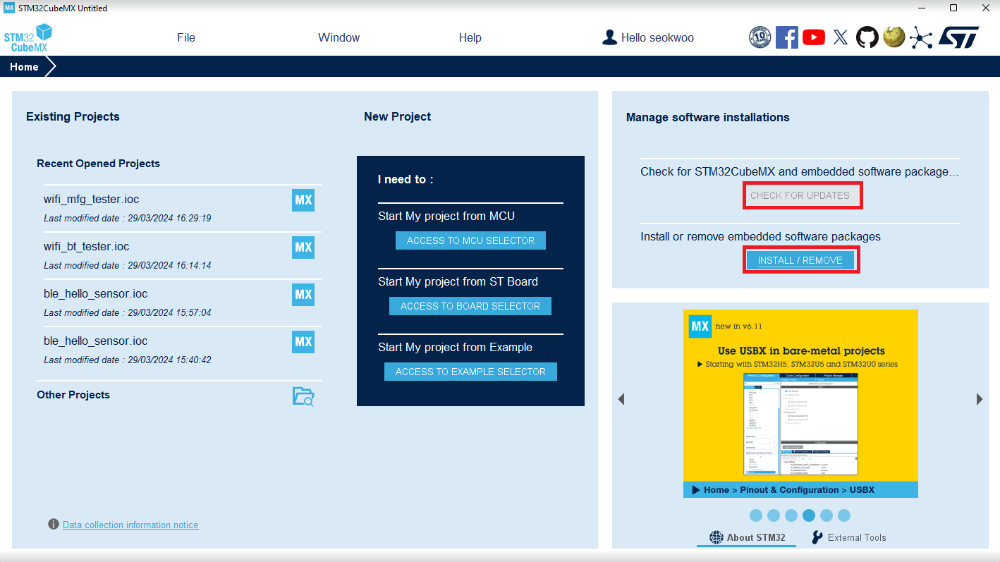


Select the option " **From Local** " and then find the " **v1.7.0 pack file** ". After locating it, ensure that you check the box for it and continue with the installation of the package.

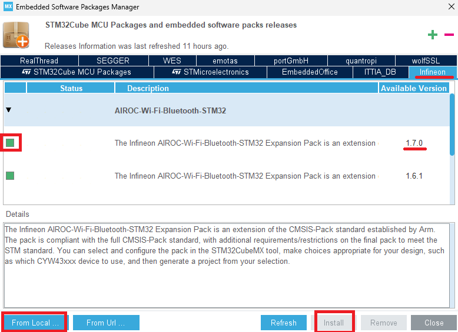

Close STM32CubeMx.

# Build wifi_bt_tester application

## Open project in STM32CubeMX

The .ioc file serves as a storage solution for initialization settings, enabling the customization of parameters and the generation of C code. After installing the expansion pack in the previous step, sample applications are created within the repository folder. It is recommended to copy a demo application into your personal directory while keeping the repository intact. This way, you can refer back to the original applications if needed.

To begin, please copy the **wifi_bt_tester** folder from the following location:

```
C:\Users\%USERNAME%\STM32Cube\Repository\Packs\Infineon\AIROC-Wi-Fi-Bluetooth-
STM32\1.7.0\Projects\STM32U575I-EV\Applications
```
to

```
C:\Users\%USERNAME%\STM32Cube\Examples.
```

Open the file wifi_bt_tester.ioc using **a text editor** and locate the line that specifies the STM32U5 firmware version.
By default, the older version, v1.2.0, is set, and it needs to be updated.

- Original: 

```
ProjectManager.FirmwarePackage=STM32Cube FW_U5 V1.2.0
```

- New:
```
ProjectManager.FirmwarePackage=STM32Cube FW_U5 V1.7.0
```
After making the change, save the file and then open wifi_bt_tester.ioc in STM32CubeMX by double-clicking it.

Next, navigate to **Pinout & Configuration** , and click on **Software Packs** > **Select Components**.

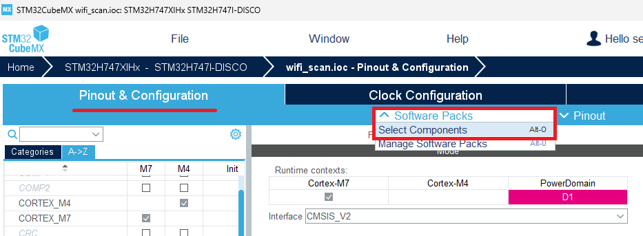

In this example, we will not be utilizing Bluetooth. Please navigate to Infineon AIROC-Wi-Fi-Bluetooth-STM32 > Wireless Connectivity > Bluetooth, and disable both **btstack** and **btstack-integration**.

Next, under Infineon AIROC-Wi-Fi-Bluetooth-STM32 > Wireless Connectivity > Platform, select **CYW55500** as the device and **SONA-IF513** as the module.

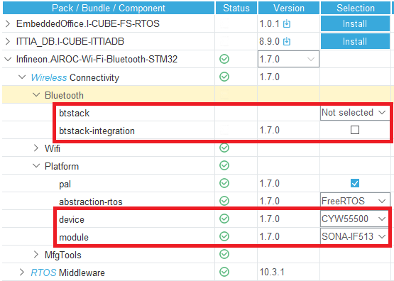

Generate Code.


Open Project.

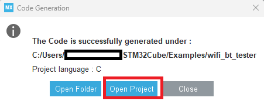


## Build project in STM32CubeIDE

### Edit files in STM32CubeIDE

Ensure that your project is open in STM32CubeIDE. To begin, please delete **bt_cfg.c** and **bt_utility** located under Middlewares > Connectivity > Wireless > MfgTools > command-console.

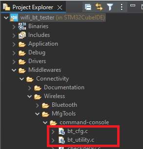

Comment out the bt_utility_init() in Application > User > Core > **console_task.c** - line# 230.

```
cy_rslt_t command_console_add_command(void)
{}
(...)

/* Initialize Bluetooth utility and add BT commands */
//bt_utility_init();
```

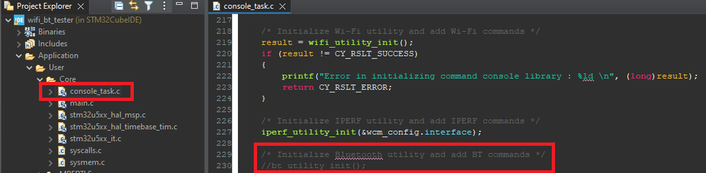

Apply [wifi_utility_12172024.patch](files/wifi_utility_12172024.patch) that modifies \Middlewares\Connectivity\Wireless\MfgTools\command-
console\wifi_utility.c.

### Apply a patch

1. **Right-click** on the project → **Team** → **Apply Patch**.
2. Under **Patch Input Specification**, select **File** and browse to **`wifi_utility_12172024.patch`**. Click **Next**.
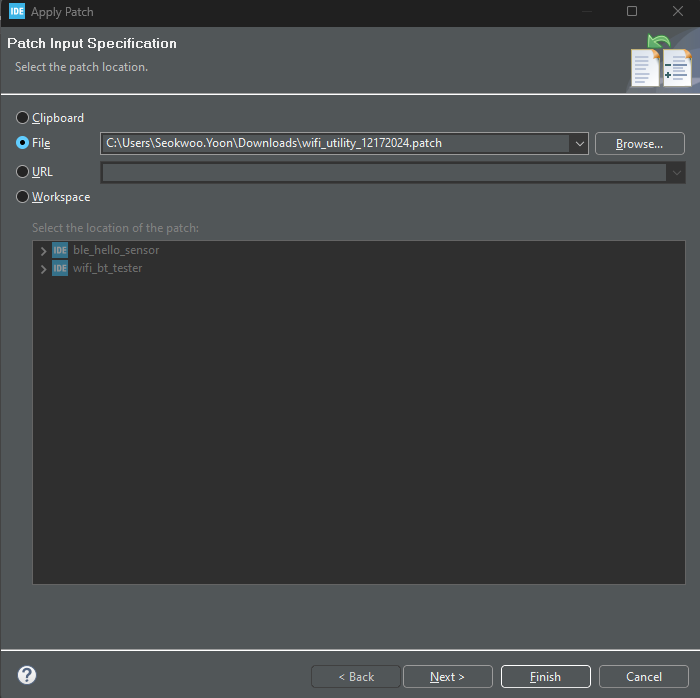
3. Choose **Apply the patch to the selected file, folder, or project**, and select: `\Middlewares\Connectivity\Wireless\MfgTools\command-console\wifi_utility.c`, and click **Next**.
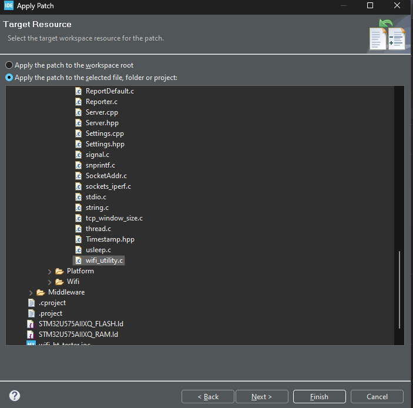
4. Set **Ignore leading path name segments** to **8**. Click **Finish** to apply the patch.
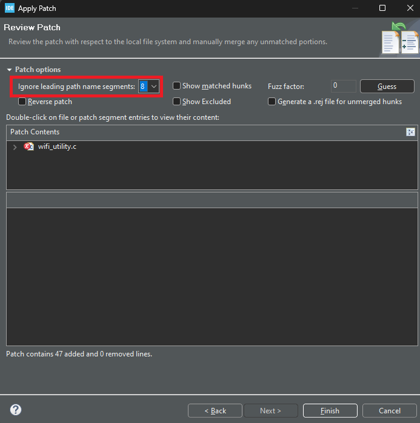


### Modify build settings

To add a build macro, please follow these steps:

1. Right-click on wifi_bt_tester in the Project Explorer and select **Properties**.
2. Navigate to **C/C++ Build** > **Settings** , then go to **MCU GCC Compiler** > **Preprocessor** under the Tool Settings.
3. Click the **+** button to include the macro "BLHS_SUPPORT".
4. Apply the changes and close the window.

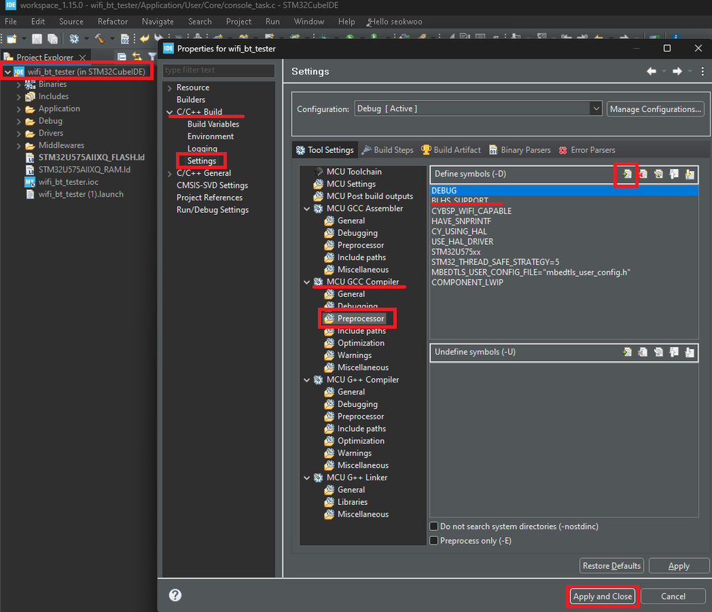

Remove “libbstack.a" in **C/C++ Build** > **Settings > MCU G++ Linker > Libraries**

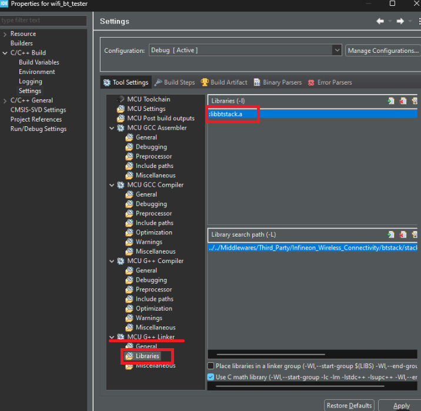

### Set GPIO to control WL_REG_ON

As previously outlined in the HW setup, pin #1 on the CN8 connector should be configured to control the WL_REG_ON function. In this demonstration, the CYBSP_WIFI_WL_REG_ON will be linked to PA4.

To make this adjustment, navigate to the file explorer and locate the file at …\wifi_bt_tester\Core\Inc\cybsp.h. Once found, edit line #77 as follows:

```
#define CYBSP_WIFI_WL_REG_ON      PB4
```

Change it to:

```
#define CYBSP_WIFI_WL_REG_ON      PA4
```

To compile the source code, navigate to the menu and select **Project > Build All**.

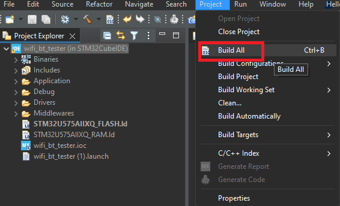

## Flash application in STM32CubeIDE

Right-click on wifi_bt_tester in the Project Explorer, then select **Run As > 1 STM32 C/C++ Application**.

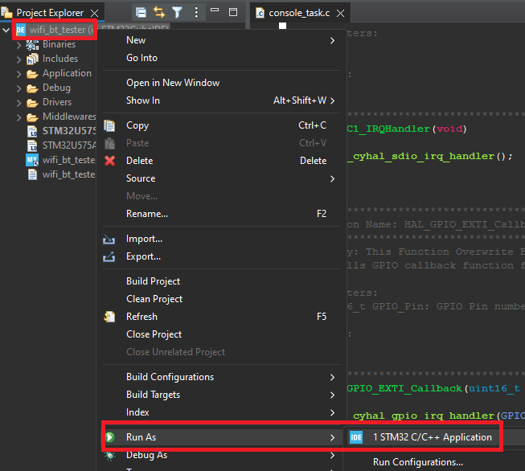

In the "Edit Configuration" pop-up, make sure to select **Debug/wifi_bt_tester.elf** before clicking OK.


# Run application

Start by launching Teraterm (or your preferred terminal emulator) with the appropriate port settings.

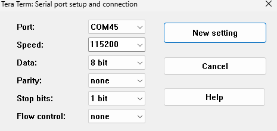

The Wi-Fi radio should initialize smoothly, and you can access the list of available commands by typing **help**.

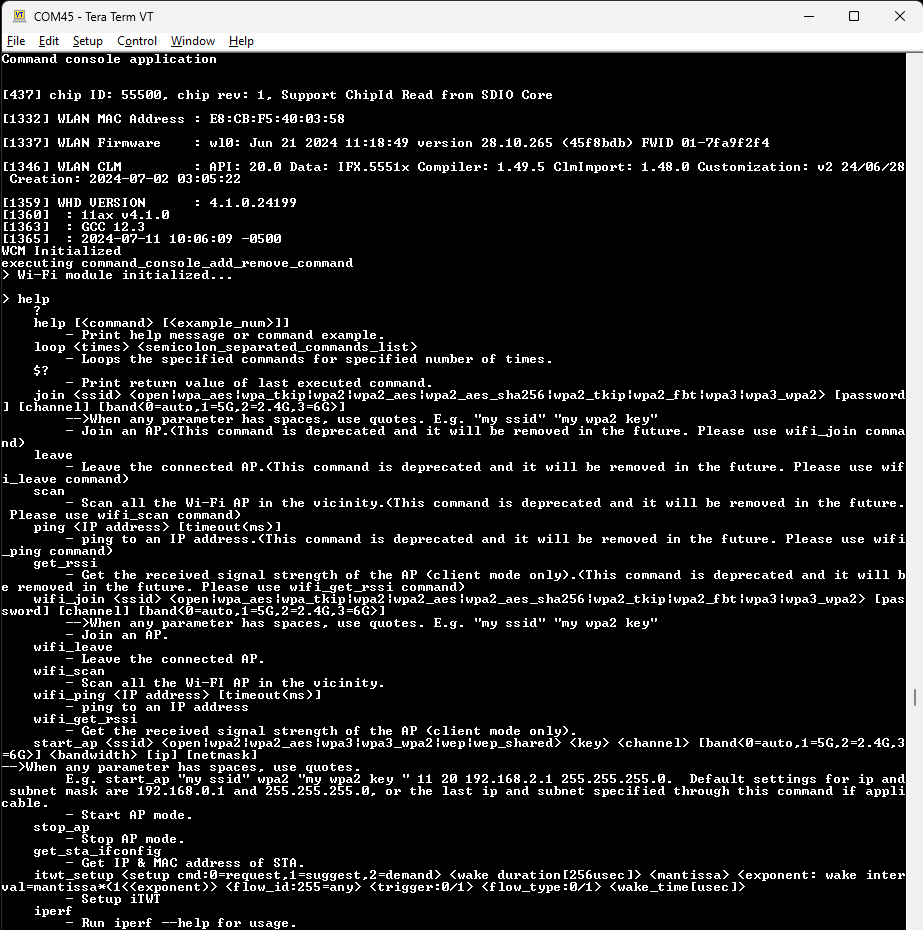

To begin, use the **wifi_scan** command to search for available Wi-Fi networks. Once you identify a network, connect to it using the **wifi_join** command. Pay attention to how the ping speed varies before and after enabling TWT (Target Wake Time).

Noticed that ping latency increased after enabling TWT. This is expected, as Target Wake Time (TWT) schedules specific wake periods for the device to save power, which can introduce additional delay for packets like ICMP (ping) that may arrive while the device is in a sleep state.

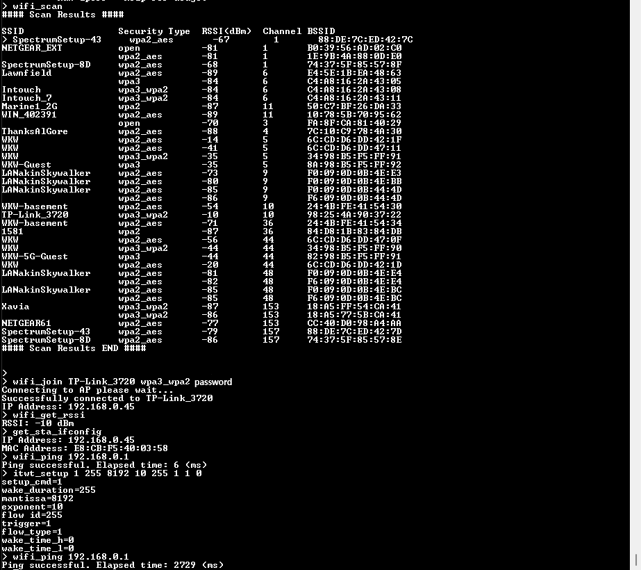

You can capture an RF trace that displays information similar to the following. The first Action packet (packet #69) originates from IF513, requesting TWT from the AP, while the second Action packet (packet #73) serves to accept that request.

Example RF trace: [TWT success - wlan.addr==E8_CB_F5_40_02_D8.pcapng](files/trace.pcapng)

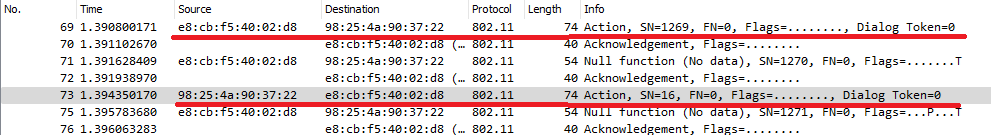

The first Action packet (packet #69):

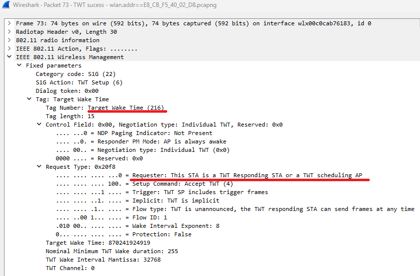

The second Action packet (packet #73):

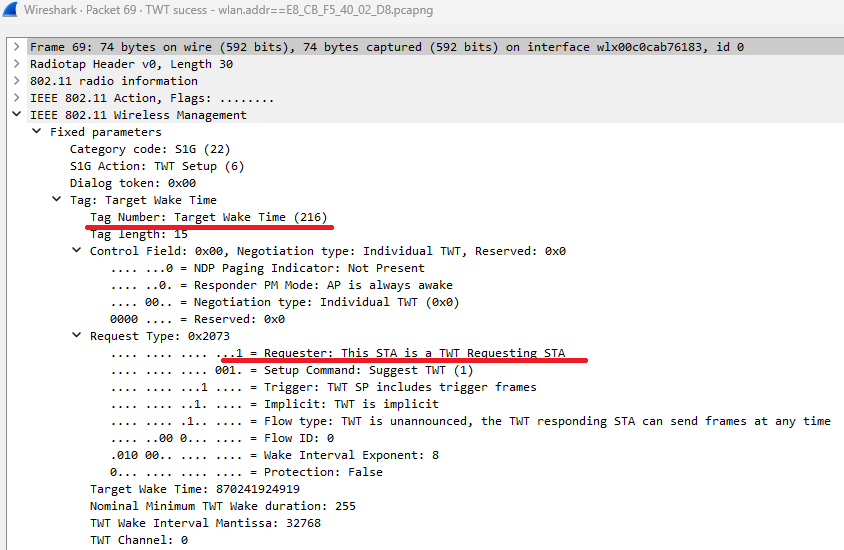

Please be aware that the AP referenced here is the BE19000 AP, and TWT (Target Wake Time) has been activated in the Wireless section.

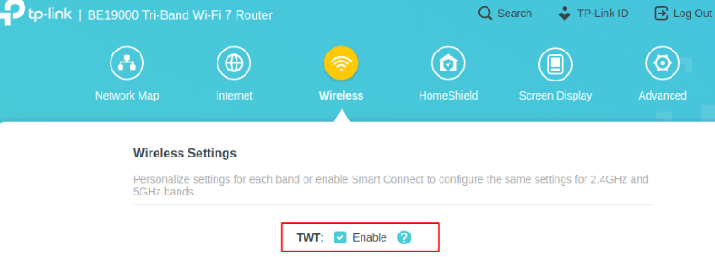


